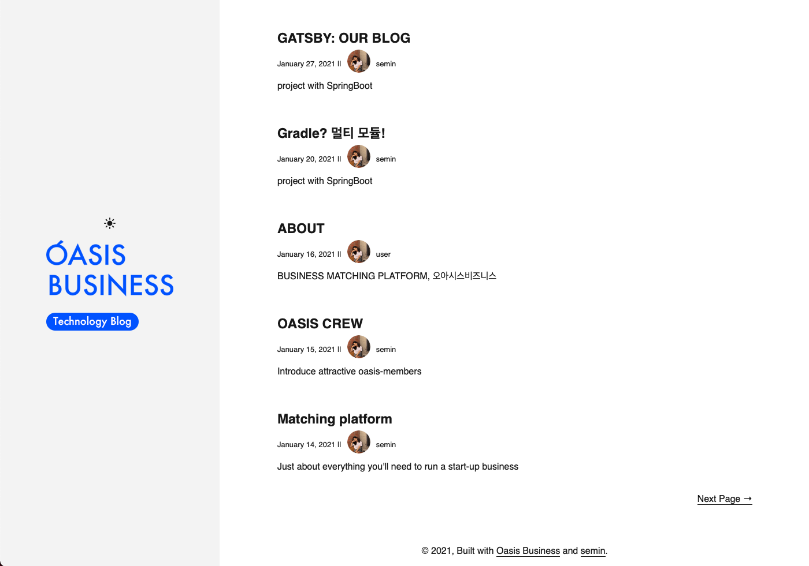

# OASIS BUSINESS BLOG
## tech & news

**[oasisbusiness](https://oasisbusiness.co.kr/)**  blog

### Preview




## Quick setup

```
1. 작성
    1. Content/blog/폴더생성/index.md 생성하여 작성
    => 폴더이름이 url명으로 들어가게됩니다. 
       ex) 폴더이름: post1 => oasisbusiness.github.io/post1
2. Commit
3. Push 전에 terminal에서 git push -f origin main 진행
4. Push
5. terminal에서 yarn deploy
```

# oasisbusiness.github.io
