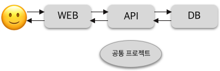

###Gradle
IntelliJ를 시작하고 gradle로 프로젝트를 생성하고 SpringBoot로 프로젝트 개발 환경을 바꿔주고..

이것저것 개발 환경을 바꿀 때 마다 이게 뭐길래 이걸로 하는걸까?싶었고

그 첫 번째 관문에서 마주친 것이 바로 gradle.


## 멀티 모듈

다중 프로젝트로 구성된 서비스에서 각 서버들마다 _공통으로 존재하는 클래스들_ 을 효율적으로 다뤄주는 것이 바로,
**Gradle Multi Module** 방식입니다.

각 서버에 동일한 클래스가 존재한다하여 그저 복사 붙여넣기에 의존하다가는 프로젝트의 규모가 커질경우
감당하기 힘든 수정의 늪에 빠지게 될 수 있습니다.
실수 또한 피할 수 없겠죠

그래서 복사 붙여넣기로 모든 서버에 동일 클래스를 존재시키는 것이 아니라
공통 클래스를 한 번만 생성하여 사용할 수 있도록 프로젝트를 구성합니다.

즉, 공통 프로젝트를 **모듈**화하여 프로젝트 안에 갖고 있는 구조입니다.

***
이 때 개발을 하고, 빌드를 할 때 만족해야하는 조건이 있습니다.
- 개발시에는 즉각적으로 공통 프로젝트 코드 사용이 용이
- 빌드시에는 자동으로 공통 프로젝트를 포함하여 빌드 진행
***

#

##멀티 모듈 설계

###구조

- 프로젝트 구조 예시
    - 사용자와 접하는 서버: WEB 프로젝트
    - DB와 접하는 서버: API 프로젝트
    - 공통으로 사용할 프로젝트: COMMON 프로젝트

#

root 프로젝트 하위에 각 프로젝트(모듈)를 생성합니다.
> **multi-modules** / module-api, module-web, module-common
>> module-common: 공통 프로젝트

이 때 root 프로젝트를 기준으로 빌드가 이루어지기 때문에 하위 프로젝트에는
gradle폴더나 redlew등의 파일이 없고 build.gradle과 src폴더만 존재한다는 점을 인지합니다.

#

---

###module-common
공통으로 사용 될 파일들을 생성합니다.

**module-common/java/com/code/domain/Member.java**
```
@Entity
public class Member {
    @Id
    @GeneratedValue
    private Long id;

    @Column
    private String name;

    @Column
    private String email;

    public Member() {
    }

    public Member(String name, String email) {
        this.name = name;
        this.email = email;
    }

    public Long getId() {
        return id;
    }

    public String getName() {
        return name;
    }

    public String getEmail() {
        return email;
    }
}
```
#

**module-common/java/com/code/repository/MemberRepository.java**
```
public interface MemberRepository extends JpaRepository<Member, Long> {
}
```
#

**module-common/build.gradle**
```
dependencies {
    compile('org.springframework.boot:spring-boot-starter-data-jpa')
    runtime('com.h2database:h2')
    testCompile('org.springframework.boot:spring-boot-starter-test')
}
```
작성한 Entity 클래스와 해당 Entity 의 repository, repository test를 위한 최소한의 의존성 추가

#

---
###module-api
module-common의 클래스들을 사용

**module-api/java/MemberServiceCustom.java**
```
@Service
public class MemberServiceCustom {

    private MemberRepository memberRepository;

    public MemberServiceCustom(MemberRepository memberRepository) {
        this.memberRepository = memberRepository;
    }

    public Long signup (Member member) {
        return memberRepository.save(member).getId();
    }
}
```
MemberRepository의 bean injection 사용

#

**module-api/build.gradle**
```
dependencies {
    compile('org.springframework.boot:spring-boot-starter-web')
    testCompile('org.springframework.boot:spring-boot-starter-test')
}
```
의존성 추가

#

---

###root 프로젝트의 settings.gradle
####module-api가 공통 프로젝트를 사용할 수 있고 spring boot 관련 의존성이 관리 되도록

#

**multi-modules/settings.gradle**
```
rootProject.name = 'multi-modules'

include 'module-common', 'module-api', 'module-web'
```
multi-modules가 module-common, module-api-module-web을 관리한다는 정의

#


**multi-modules/gradle.build**
```
buildscript {
    ext {
        springBootVersion = '1.5.1.RELEASE'
    }
    repositories {
        mavenCentral()
    }
    dependencies {
        classpath("org.springframework.boot:spring-boot-gradle-plugin:${springBootVersion}")
        classpath "io.spring.gradle:dependency-management-plugin:0.6.0.RELEASE"
    }
}

subprojects {
    group 'com.blogcode'
    version '1.0'

    apply plugin: 'java'
    apply plugin: 'spring-boot'
    apply plugin: 'io.spring.dependency-management'

    sourceCompatibility = 1.8

    repositories {
        mavenCentral()
    }

    dependencies {
        testCompile group: 'junit', name: 'junit', version: '4.12'
    }
}

project(':module-api') {
    dependencies {
        compile project(':module-common')
    }
}

project(':module-web') {
    dependencies {
        compile project(':module-common')
    }
}
```
subprojects와 project()

#

###subprojects
settings.gradle에서 정의해둔 하위 프로젝트들을 관리합니다.

하위 프로젝트들의 의존성과 관련된 plugin을 등록합니다. ex)SpringBoot, Java

_root 프로젝트의 의존성까지 관리하고자 하면 allprojects로 관리합니다._

###project
```
project(':하위 프로젝트 명') {
  dependencies {
    complie project(':의존하고있는 공통 프로젝트 명')
    }
  }
```
_: 디렉토리 path 표시_


###👉🏻멀티 모듈 구조 완성!

#

[^2]: 멀티 모듈 빌드

위에서 얘기했던 멀티 모듈 빌드시 만족 조건을 기억하시나요?
>빌드시에는 자동으로 공통 프로젝트를 포함하여 빌드 진행

하지만 코드를 살펴보면 module-common에는 main메소드가 없기 때문에 프로젝트 빌드에 실패하게됩니다.
> 단순한 참조용 클래스: jar형태로 만들 수 없음

###gradle에서 제공하는 bootRepackage.enabled

**module-common/build.gradle에 추가**
```
bootRepackage {
    enabled = false
}
```

#

**스프링 부트 2.0 이상**
```
bootJar { enabled = false }
jar { enabled = true }
```


#

이로써 빌드까지 완벽히 가능한, 멀티 모듈 구조를 알아보고 함께 작성까지 해보았습니다!
멀티 모듈 구조를 이용하려는 분들에게 유용한 자료가 됐길 바랍니다.

감사합니다.

#
#

---

######참조 사이트: 기억보단 기록을, "gradle 멀티모듈", https://jojoldu.tistory.com/123, (2021.01.20)

#
