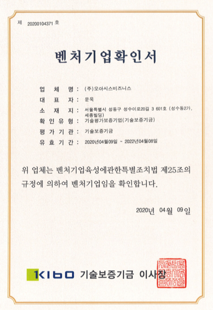
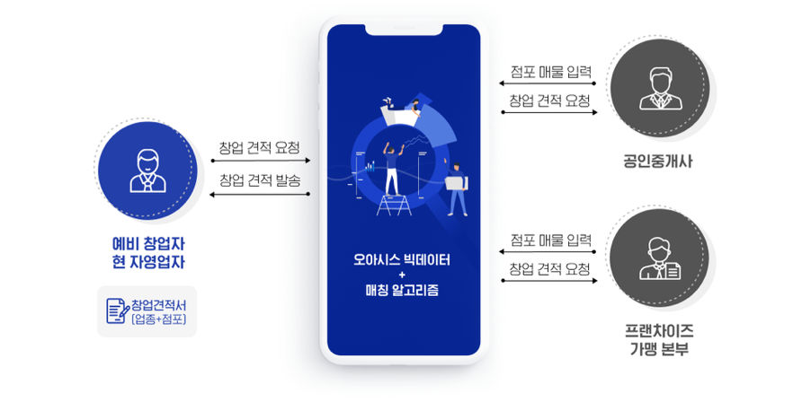

## Our Services
###오아시스 비즈니스는 창업을 준비 중인 에비창업가와 가맹점을 더 확장하고 싶은 파트너사와의 매칭을 돕습니다.

#

오아시스 비즈니스는 정부 지원 사업인 데이터 바우처에 선정된 경쟁력을 바탕으로 상권 분석 자료가 **AI 기반**으로 정보를 제공하는 **‘오아시스 비즈니스’ 플랫폼**을 개발하여
창업자에게 프랜차이즈 및 상가 등 조건에 맞는 견적서를 제공하고 있습니다.

#

오아시스 비즈니스는 빅데이터 매칭 알고리즘 기반의 업종, 점포 맞춤 견적 O2O 플랫폼의 기술력과 잠재력을 인정받아 **벤처기업 인증**을 획득했는데요. 
벤처 인증은 _공식 기관의 검증_ 이기에, 창업자들에게 제공하는 지원과 정보의 신뢰도 및 범위가 확장되었음을 의미하기도 합니다.

벤처기업 인증을 받은 오아시스 비즈니스는 예비창업자가 창업 조건을 입력만 하면 창업 비용+점포비용 비교견적을 한 번에 알려주는 서비스입니다. 
창업박람회, 프랜차이즈 설명회, 부동산 등 직접 찾아다닐 필요 없이 실시간으로 상권분석부터 점포 물색까지 오아시스 비즈니스에서 쉽고, 간단하고, 빠르게 한 번에 비교해 보실 수 있습니다.

