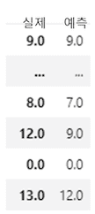
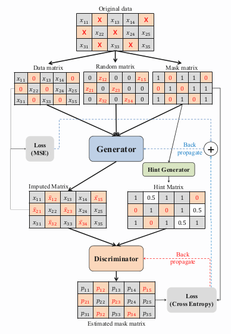
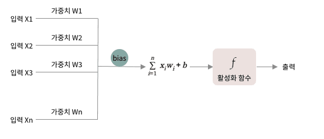
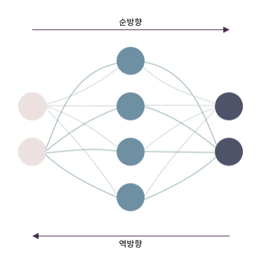

# 딥러닝으로 재해석하는 빅데이터

기계학습이 가능한 프로그램에 인공 신경망을 사용하여 빅데이터를 학습하는 인공지능을 통해 우리는 빅데이터로부터 원하는 분석 결과를 얻을 수 있습니다.

데이터를 크롤링, Open API, FTP, RSS 등을 통해 수집한 빅데이터를 어떻게하면 원하는 곳에 필요한 정보로서 쓸 수 있을까요?

수집한 데이터들로 부터 쓸만한 정보를 추출해낼 수 있어야 열심히 모은 데이터들이 값어치가있다고 할 수 있겠죠?

적절한 특징을 잡아내어 한데 모아져있던 데이터들을 비슷한 데이터들끼리 분류합니다.

## 데이터 수집

데이터 구매, 공공데이터의 수집, 크롤링을 통한 배후지의 특성을 나타낼 수 있는 다양한 분야의 데이터를 수집합니다.

## 데이터 전처리

다양한 출처로 부터 얻은 데이터를 함께 사용 가능하도록 맞춰주는 작업과 수집한 데이터로부터의 새로운 값 재가공, 최적의 인공지능 모델을 가공하여 결측치 처리에 검증 및 활용, 다양한 항목중 학습에 필요한 항목을 선택, 입력변수를 줄이기 위한 차원 축소 작업을 합니다.

## 데이터 학습, 매개변수 조정, 데이터 재가공

전처리 작업을 한 데이터를 입력시켜 딥러닝 모델에 학습을 시킨뒤 나오는 결과의 편향과 분산을 확인하고 편향과 분산을 더 낮춰주기 위한 모델의 크기, 활성함수, 최적화 등의 작업을 합니다. 또한 모델이 데이터를 더 잘 활용할 수 있도록 다양한 모델의 가공 작업을 합니다.

## 결측처리

업무과정중에 어려웠던 부분은 결측 처리부분이었습니다.

100만 단위의 데이터를 다루다보면 결측데이터가 있기 마련인데, 수백개의 항목중 한두개의 결측이 있다고 해서 데이터를 지우기엔 아깝기도 하고 가능한 많은 데이터를 확보하는 것이 DNN 모델 성능 향상에 큰 도움이 되기 때문에 이러한 결측을 처리하는 모델 혹은 알고리즘 확보가 우선이었습니다. 대표적인 결측 처리모델인 MICE, MissForest등을 테스트 해보았고 현재는 GAN (generative모델) 을 이용하여 높은 성능의 결측 처리를 하고있습니다.

그에 관한 내용과 실제 우리가 결측 채우는 모델을 사용한 결과의 성능을 보여줄수 있는 이미지를 캡쳐한 자료입니다

결측 처리 모델의 구성도 사진입니다.

_이미지 출처: GAIN: Missing Data Imputation using Generative Adversarial Nets_

## 학습

기계학습을 위해 컴퓨터에 데이터를 입력합니다. 이때 레이블이 주어지거나 주어지지 않는 데이터 입력 방법에 따라 지도학습과 비지도학습으로 나뉩니다. 지도학습은 레이블이 주어지기때문에 원인이되는 데이터로부터 결과 데이터값이 나올 수 있는 매핑 함수를 찾는다고도 말할 수 있습니다. 반면 비지도학습은 레이블이 주어지지않기 때문에 컴퓨터가 스스로 입력된 데이터들간의 상관도를 비교 분석하여 유사 데이터들을 군집화합니다.

이렇게 학습에 사용되는 데이터를 학습데이터라고 하며 학습이 잘 이루어졌는지 테스트하는 데이터를 테스트 데이터라고 합니다. 이때, 테스트 데이터는 학습에 사용되지않은 데이터여야합니다.

한 번 모든 데이터에 대해 최적화를 진행하며 하는 학습을 배치 학습이라고 칭하며 전체 데이터세트를 적절한 배치 사이즈로 나누어 한번 일부 데이터만 학습하는 것은 미니 배치 학습이라고 합니다. 모든 데이터 세트를 학습하는 것을 1 에포크 라고 합니다.

즉, 모든 데이터가 100개고 미니배치 크기가 10개라면 1에포크는 10개씩 나뉘어진 데이터(미니배치)를 총 10번 학습하여야 완료됩니다.

### 은닉층

이렇게 입출력 데이터만을 이용하는 신경망으로는 선형분리만 가능하지만 비선형 분리는 불가능하게됩니다. 그래서 은닉층을 추가하여 보다 복잡한 분류를 가능하게합니다. 은닉층이 한개 이상 추가된 신경망을 MLP라고하며 여기서 은닉층이 더 추가되면 레이어가 깊다고 하여 DNN(Deep Neural Network)라고 합니다.

### 활성화 함수

활성화 함수를 통해 인공신경망을 거친 값이 결과적으로 어떤 값이 될지를 결정합니다. MLP의 경우 주로 Sigmoid function을 사용하고 DNN의 경우 주로 ReLU function을 사용합니다. MLP에서 DNN으로 넘어오면서 활성화 함수를 ReLU function으로 바꾸는 이유는 바로 그래디언트 소멸 문제 때문입니다.

DNN이 MLP보다 은닉층이 많아지면서 출력층에서 계산된 그래디언트 값이 역전파되는 중에 점점 작아지다가 소멸되어 없어지는 문제가 발생합니다. 이는 MLP의 활성화 함수인 Sigmoid function때문인데요, Sigmoid function의 경우 값이 포화상태에 이르를 경우 기울기값이 0으로 초기화되는 특성이 있는데 DNN의 경우 다수의 은닉층으로 인해 0으로 수렴된 값이 역전파되어 결국 모든 값에 0이 곱해져 소멸되게됩니다.

### 역전파

그래디언트값이 역전파된다는게 뭘까요? 주어진 입력으로부터 출력이 계산되는 것을 순방향 계산이라고 합니다. 순방향으로 계산된 출력값과 원하는 출력값의 격차를 줄이기 위해 발생한 오차를 역방향으로 전파하여 가중치 변경을 통해 오차를 줄여나가는 것을 역전파 알고리즘이라고합니다. (하나의 층에서 다른 층으로 값이 전달될 때 연결 가중치를 통해서 전달됨)

출력층에서 계산된 오차로부터 은닉층의 오차를 계산하여 해당 값을 입력층으로 역전파시켜 출력층이 정확해질때까지 반복합니다.

