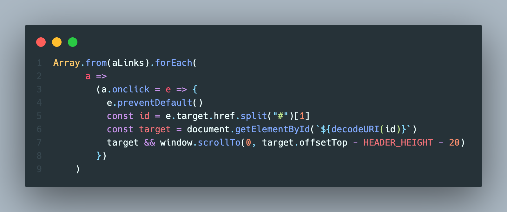

# Heading1

`# Heading1`  
제목

## Heading2

`## Heading2`  
부제목

### 볼드

`**bold**`  
**bold**

### 이탤릭

`_이탤릭_`  
_이탤릭_

## 인용

`> 인용문은 이렇게 나옵니다.`

> 인용문은 이렇게 나옵니다.

## 이미지

``


### 코드블럭

백틱(`) 세번! 으로 감싸서 사용

````
```
// 주석
console.log("hello world")
console.log("hello world again")
```
````

```javascript
// 주석
console.log("hello world")
console.log("hello world again")
```

## 오아시스 블로그 우측 ToC 기능

### h1 ~ h3 표시 됩니다

#### heading4

`#### heading4`  
h4 부터는 적용이 안된다!

##### heading5

`#### heading5`
