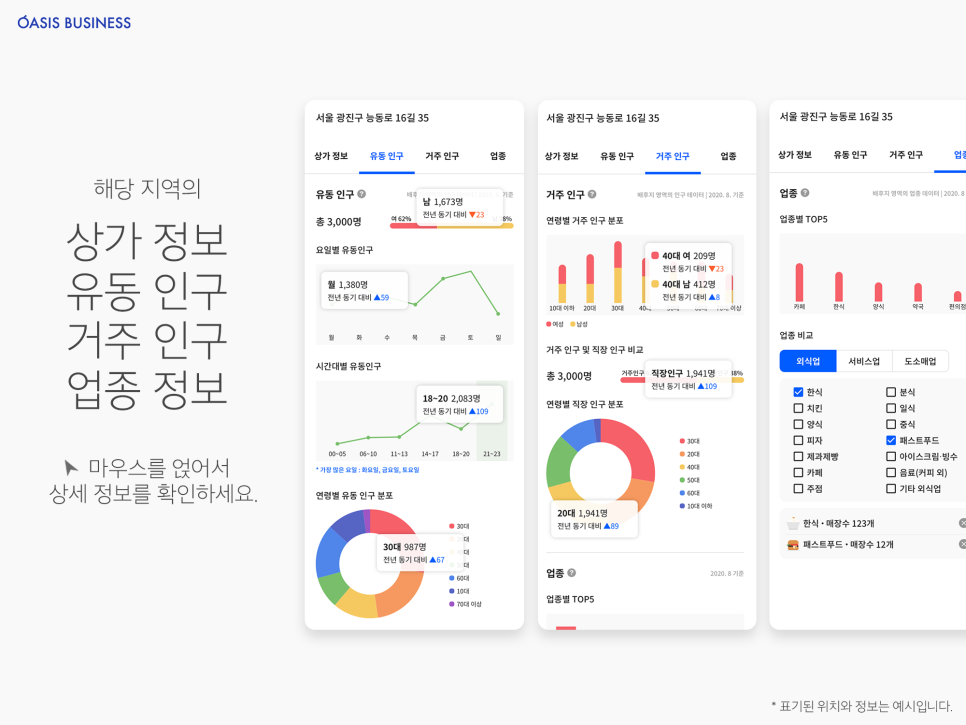

오아시스 비즈니스만의 데이터로 분석해낸 상권 정보를 확인하세요

###Our AI Model

```
<!-- DNN
wtih TensorFlow (텐서플로) -->

model = tf.keras.Sequential([
    tf.keras.layers.SimpleRNN(units=4, activation='tanh', return_sequences=True, input_shape=[4,1])
])

model.compile(optimizer='adam', loss='mse')
model.summary()
```

## 상권 분석

창업에 필요한 상권 분석 데이터를 바로 보여드립니다.

> 상가 정보 • 유동 인구 • 거주 인구 • 업종 정보



지도에서 원하는 건물을 선택하기만 하면 그곳의 상권 정보를 알려드립니다.

    1. 상가 정보
        - 주차장 개수
        - 정류장
        - 도로까지의 거리

    2. 유동 인구
        - 요일 별 유동인구
        - 시간대별 유동인구
        - 연령별 분포도

    3. 거주 인구
        - 거주/직장 인구의 비율
        - 연령병 인 분포

    4. 업종
        - 업종 별 전년대비 개수
